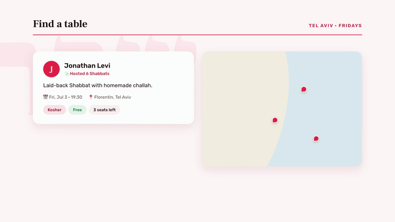
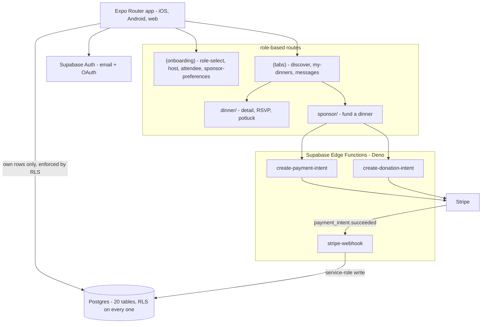

# Shishi

A three-sided platform that funds and organizes Shabbat dinners in Tel Aviv — connecting
**sponsors** who underwrite dinners, **hosts** who open their homes, and **attendees**
looking for a seat at the table.



▶ [Watch with sound](https://ethansaba.com/videos/shishi.mp4) — "A seat at the table for every Jew who wants one."
· **[Live demo](https://shishi-app.vercel.app/)**

## What it does

- **Hosts** publish a dinner — date, capacity, kosher level, home vibe — and manage RSVPs.
- **Attendees** discover dinners on a map, RSVP, and claim potluck items so ten people
  don't all bring hummus.
- **Sponsors** underwrite dinners through Stripe, with preferences for the kind of dinner
  they want to fund.
- **Everyone** messages within a dinner thread, and can report a problem — a platform that
  puts strangers in each other's homes needs a moderation path on day one.
- **Try it without an account** — `/demo` picks a role and runs the real flows.

## Architecture

An Expo Router app that ships to iOS, Android, and web from one codebase, over Supabase.
Payments never touch the client: the app requests an intent, an Edge Function talks to
Stripe, and a webhook is the only thing that marks a donation paid.



**Data model:** `profiles`, `host_details`, `sponsor_details`, `dinners`, `rsvps`,
`potluck_items`, `potluck_claims`, `messages`, `sponsor_donations`, `reports`.

## Run it locally

```bash
supabase start                  # local Postgres + Auth + Studio
supabase db push                # apply schema.sql + migrations

cd mobile
npm install
cp .env.example .env            # fill in the values `supabase start` printed
npx expo start                  # press w for web, i / a for simulators
```

Stripe is optional for local development — the payment flows need
`STRIPE_SECRET_KEY` and `STRIPE_WEBHOOK_SECRET` set as Supabase project secrets
(`supabase secrets set`), never in `.env`.

Seeding Discover with sample dinners is part of the migrations: four synthetic host
accounts under an `@shishi.seed` domain, with random passwords and no real inbox.

## Notable decisions

**One person can be more than one role.** Sponsors, hosts, and attendees aren't separate
account types — they're flags on a `profile`, because the same person often hosts one week
and attends the next. Modeling them as three user tables would have made the common case
the hard case.

**Row Level Security on all 20 tables.** Every table enables RLS with policies scoping
access to the requesting user — 52 policies total. A dinner guest list, a private message
thread, and a sponsor's donation history are all things the database itself refuses to
hand to the wrong account, independent of client code.

**Stripe is server-only, and the webhook is the source of truth.** The client asks an Edge
Function for a payment intent; it never holds a secret key. A donation is marked paid when
`payment_intent.succeeded` arrives at the webhook — not when the client says the payment
worked, which is a claim an attacker controls.

**Seeded dinners expire on their own.** Sample data flips `published → past` once its date
passes and is deleted a month later. Demo data that lingers as "upcoming" makes a live
product look abandoned.

**Reporting shipped with the first release, not after an incident.** `reports` and
`report.tsx` exist because the product's core action is going to a stranger's home for
dinner. Trust and safety isn't a v2 feature for that.

## Status

MVP. The full attendee and host journeys — onboarding, publishing, discovery, RSVP,
potluck, messaging — work end to end against Supabase, and the sponsor flow runs against
Stripe test mode. It has not been operated with real dinners or real money.

## Project structure

| Path | What's there |
|---|---|
| `mobile/app/` | Expo Router routes, grouped by role and flow |
| `mobile/components/`, `mobile/lib/` | Shared UI and Supabase client |
| `supabase/schema.sql`, `supabase/migrations/` | Schema, RLS policies, seed data |
| `supabase/functions/` | Deno Edge Functions for Stripe |
| `docs/PRODUCT_BIBLE.md` | Full product spec — features, journeys, open questions |

[`docs/PRODUCT_BIBLE.md`](docs/PRODUCT_BIBLE.md) is the source of truth for product
decisions and is enforced as always-on context for AI agents working in this repo.
